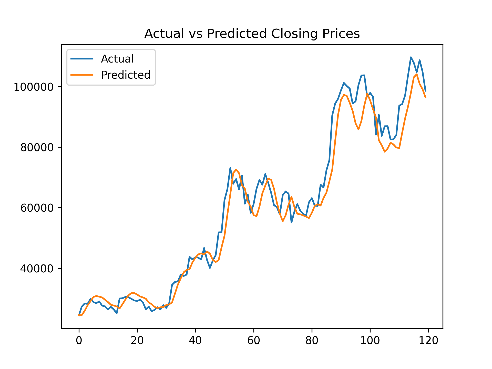

<h1 align="center">Crypto Price Forecasting with LSTM</h1>
<p align="center">Predict the future of Bitcoin prices using deep learning and public market data from Kraken </p>

<p align="center">
  
</p>

<p align="center">
  <a href="https://img.shields.io/badge/Python-3.12-blue"></a>
  <a href="#"></a>
  <a href="#"></a>
  <a href="#"></a>
</p>

---

## 📚 Table of Contents

- [🚀 Overview](#-overview)
- [📦 Dataset](#-dataset)
- [🧠 Model](#-model)
- [📈 Results](#-results)
- [🛠 Setup](#-setup)
- [🧰 Built With](#-built-with)
- [✅ Future Work](#-future-work)
- [🙌 Acknowledgements](#-acknowledgements)
- [📜 License](#-license)

---

## Overview

This project explores how to use sequential models (LSTM) to forecast future **Bitcoin (BTC/USD)** prices based on weekly OHLC (Open, High, Low, Close) data pulled from the **Kraken API**. The model learns temporal patterns to predict the next week's closing price.

---

## Dataset

- **Source**: [Kraken Public OHLC API](https://docs.kraken.com/rest/#operation/getOHLCData)
- **Pair**: `XBTUSD`
- **Interval**: Weekly candles (`10080` minutes)
- **Samples**: 720 entries = ~13.8 years of data

Each row includes:
[time, open, high, low, close, vwap, volume, count]

---

## Model

- **Type**: LSTM Neural Network
- **Input**: Last 12 weeks of closing prices
- **Target**: Next week’s closing price
- **Loss**: MSE (Mean Squared Error)
- **Optimizer**: Adam

```python
model = Sequential()
model.add(LSTM(64, input_shape=(12, 1)))
model.add(Dense(1))
model.compile(optimizer='adam', loss='mse')
```

---
## Results
- **Sample output below (actual vs predicted closing prices)**
<p align="center">  </p>

- Validation MSE: coming soon
- Model captures macro trends reasonably well
- Still tuning for sharper short-term precision

---

## Setup

1. Clone the repo

```bash
git clone https://github.com/yourusername/crypto-forecasting.git
cd crypto-forecasting
```
2. Install dependencies
```bash
pip install -r requirements.txt
```

3. Fetch data from Kraken
```bash
python fetch_data.py
```

4. Train the model
```bash
python train_model.py
```

---

## Model Evaluation
Initial experiments started with raw closing price prediction. In v2, we introduced percent return features, expanded to OHLCV inputs, added dropout regularization, and stacked LSTM layers with early stopping. Performance dropped slightly (higher RMSE), but the model structure is now better suited for learning temporal patterns—future tuning will address this.

| Version | Change | RMSE |
|---------|--------|------|
| v1 | Raw closing price prediction | 5452.00 |
| v2 | + OHLCV features, + percent return, + stacked LSTMS(128->64) + Dropout(0.2), + EarlyStopping, fixed inverse scaling | 7348.37 |
| v3 (in progress) | predict log return instead of prices/percent returns, rolling volatility, moving average | (TBA) |
